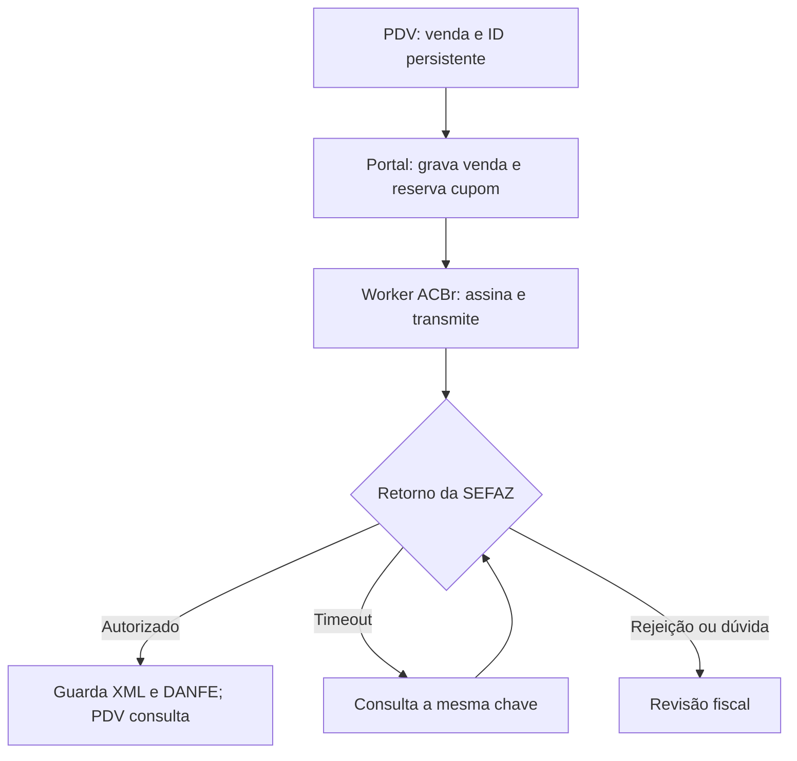

# NFC-e de mercadorias no Facinho: base de homologação

Pesquisa e implementação preparatória em 09/10/2026. A prioridade é emitir o cupom das compras de mercadorias feitas nos PDVs. O portal foi publicado com controles de ambiente/agendas; o emissor permanece restrito a **homologação, sem valor fiscal**. Não houve autorização na SEFAZ nem alteração dos PDVs Android.

## Documento e estabelecimento

Para o varejo paulista, a prioridade é a **NFC-e, modelo 65**, autorizada pela **SEFAZ-SP**. Desde 01/01/2026, ela substitui o CF-e-SAT nas operações abrangidas. A assinatura digital, o XML, o protocolo de autorização e o DANFE com QR Code compõem o fluxo fiscal; gravar uma venda no portal não representa autorização fiscal. [1][2]

Consultas públicas secundárias identificam o CNPJ **57.423.823/0001-47** como **P & R Mercados Ltda**, Araçatuba/SP, CNAE 4712-1/00 e optante do Simples Nacional. A IE **177.647.515.117** apareceu em cadastro secundário. Esses dados são candidatos à conferência: consultar a situação oficial no Simples, o CADESP e o credenciamento NFC-e antes de cadastrar emitentes. Nenhum emitente real foi ativado automaticamente. [3]

As RC 29539/2024 e 27772/2023 tratam de micromercados em condomínios: a orientação paulista exige inscrição estadual para cada estabelecimento, admitindo pedido de regime especial. São respostas a consulentes específicos e orientam a análise da operação semelhante; não comprovam o enquadramento individual da Facinho. **O processamento pode ser centralizado; a identificação do emitente deve corresponder ao estabelecimento habilitado.** Conferir CNPJ, IE, endereço, CSC, série e eventual regime especial por unidade. [4]

## Reforma tributária e Simples

| Período ou decisão | Consequência para a operação |
| --- | --- |
| 2026 | A cobrança de teste de CBS 0,9% e IBS 0,1% não se aplica aos optantes do Simples. Não somar automaticamente 1% às vendas. [5] |
| 2027 | CBS/IBS passam às regras do Simples, com escolha entre recolhimento no DAS e regime regular para esses tributos. Quem já é optante não precisa renovar apenas para permanecer, ressalvada exclusão futura. [6] |
| Escolha para janeiro a junho de 2027 | A Resolução CGSN 194 prorrogou a opção pelo regime regular de IBS/CBS até **30/10/2026**. Cancelamento da opção: **03/11 a 20/12/2026**. O prazo de ingresso/retorno ao Simples é distinto: 15/10/2026. [7] |
| Mercadorias | NCM, regime, origem, ST e monofásico precisam de revisão por item e vigência. A alíquota zero de IBS/CBS para produtos da cesta básica não torna todo o DAS zero. [8][9] |

Para um mercadinho que vende principalmente a consumidores finais, manter IBS/CBS no DAS é um cenário inicial a comparar com o regime regular, não uma decisão automática. A comparação depende da receita bruta acumulada em 12 meses, receitas segregadas, notas de compras e créditos admitidos, margem e participação de vendas a empresas. O CNPJ, sozinho, não permite calcular a carga tributária ou a economia.

Em 2026, a segregação correta de receitas com ICMS-ST e PIS/Cofins monofásicos continua relevante no PGDAS-D. O cupom precisa preservar a classificação de cada item para viabilizar a apuração. **Este módulo emite documentos de teste; ele não calcula nem entrega PGDAS-D/DAS.** [9]

As orientações da Receita apontam obrigações documentais para o Simples a partir de 01/01/2027. O código bloqueia vendas de 2027 até que perfis e leiautes RTC sejam implementados e testados. Na consulta de 09/10, o Portal NF-e publicou a NT 2025.002 v1.52 e o IT 2025.002 v1.70; o aviso de 05/10 postergou a implantação das NT 2025.002 v1.52, 2026.007 v1.10 e 2026.008 v1.00 para 26/10 em homologação e 16/11 em produção. Atualizar ACBr, schemas, tabelas e regras conforme a data de implantação, sem presumir que instalar o pacote Node atualiza a biblioteca nativa. [10]

## Código reaproveitado e arquitetura

O repositório `rickfateb/caixa` já contém Node.js, Express, PostgreSQL, autenticação dos caixas e `POST /api/v1/sales` com idempotência. O servidor do repositório `facinho` possui administração de unidades/PDVs, mas não implementa esse contrato de recebimento. A integração foi preparada no serviço que já recebe vendas; a unificação de navegação/domínio entre portais é uma etapa própria.

| Projeto explorado | Avaliação |
| --- | --- |
| [ACBrLib-Nodejs oficial](https://github.com/Projeto-ACBr-Oficial/ACBrLib-Nodejs) | Escolhido. Wrapper Node compatível com o servidor existente; usa ACBr para assinatura, schemas, comunicação com SEFAZ e DANFE. Pacote fixado em `@projetoacbr/acbrlib-nfe-node@1.0.11`. |
| [NFePHP/sped-nfe](https://github.com/nfephp-org/sped-nfe) | Alternativa PHP, com LGPLv3/MIT. Acrescentaria serviço PHP; DANFE exige a biblioteca correspondente. |
| [Zeus/DFe.NET](https://github.com/ZeusAutomacao/DFe.NET) | Alternativa .NET, LGPL-2.1; acrescentaria outro runtime. |

O wrapper oficial ACBr é LGPL-2.1. A dependência mantém sua licença; não foram copiados fontes de terceiros para o projeto. A `.so`/`.dll` nativa, suas dependências e os schemas não acompanham esta implementação. O projeto ACBr disponibiliza binários compilados no Clube ACBr PRO e fontes para compilação; versão, distribuição e obrigações de licença devem ser conferidas antes da entrega do executável. Nenhuma assinatura ou compra foi realizada. [11]



Número, chave, fotografia dos itens e XML assinado são persistidos antes da transmissão. Um timeout mantém o resultado desconhecido e provoca consulta pela mesma chave. Esta etapa não reenvia automaticamente depois de uma consulta inconclusiva; deixa o documento para conciliação, evitando emitir outro cupom para a mesma venda.

## Implementado nesta branch

- Migração `010_fiscal_homologation.sql`: emitentes por unidade, perfis fiscais revisados por produto e documentos com numeração única. Não enfileira histórico antigo.
- `POST /api/v1/sales`: conserva o contrato e a idempotência; devolve também `fiscal`. Em homologação, sem emitente habilitado, retorna `DISABLED` e mantém a venda operacional. Seleção de oficial retorna bloqueio explícito de produção pendente.
- Reserva de numeração transacional com bloqueio do emitente e da venda, restrições de unicidade e fotografia fiscal com hash canônico, independente da ordem das chaves no JSONB.
- Worker dedicado; as chamadas síncronas à biblioteca nativa ficam fora do processo HTTP. Bloqueio consultivo do PostgreSQL limita a um worker por banco nesta etapa.
- Assinatura/validação pelo ACBr; autorização reconhecida somente com chave correspondente, ambiente 2, `cStat=100`, protocolo e XML processado. Sucesso do lote não significa autorização do cupom.
- Protocolo armazenado como texto: São Paulo passou a usar 17 posições em produção em 05/10/2026. [1]
- Aba Fiscal com emitentes, perfis revisados, estados dos documentos e download de XML/PDF; API do PDV restrita às próprias vendas.
- Certificado e CSC ficam no runtime do worker; não entram no payload do Android nem no cadastro público do portal.

Estados: `BLOCKED` sem número reservado; `PENDING`; `SIGNED`; `SUBMITTING`; `UNKNOWN`; `AUTHORIZED`; `REJECTED`; `MANUAL`. Falha apenas no PDF conserva a autorização e tenta gerar o DANFE novamente, sem emitir outra nota.

O perfil inicial é restrito a revenda interna SP, CRT 1, CFOP/CSOSN `5102/102` ou `5405/500`, com PIS/Cofins e origem revisados. Isso não cobre todos os tratamentos dos mercadinhos: campos de ICMS-ST retido, FCP, benefícios, outras operações e eventuais particularidades devem ser implementados conforme o cadastro fiscal aprovado. Não converter todo o catálogo para CSOSN 102.

## Ambientes por maquininha/PDV e agendas

Em **Fiscal > Ambientes e agendas**, o administrador pode escolher `Oficial`, `Homologação`, `Desabilitado` ou `Padrão do serviço` para cada caixa. O padrão inicial do serviço é homologação; configurações anteriores são preservadas. Desabilitado também pode ser padrão do serviço ou destino de uma agenda. A escolha de Oficial fica registrada, mas não libera emissão real nesta versão: aparece como pendente, com `PRODUCTION_NOT_READY`, sem gerar cupom de teste como substituto.

**Desabilitado** conserva a venda operacional, sem criar documento fiscal, enfileirar emissão ou reservar numeração. A venda permanece desabilitada em reenvios, reinícios e mudanças de agenda. Em **Vendas > Detalhes** aparece **Gerar cupom**; a mesma ação está disponível na listagem Fiscal. Somente um administrador pode solicitar a geração manual, escolhendo um ambiente real de emissão. Visualizar a venda, atualizar o estado ou consultar a prévia não gera notas.

A geração manual é auditada e tem uma solicitação única por venda. Repetições consultam/reutilizam o mesmo documento e número. Ela mantém a decisão automática original separada da escolha manual. A opção Oficial permanece bloqueada, sem consumo de número nem fallback; a interface só habilita Homologação enquanto produção não estiver validada. Se faltar emitente ou classificação, a pendência aparece e exige outra ação manual após a correção: reenvio do PDV não prepara o documento. Um cupom autorizado passa a oferecer XML/PDF no lugar de Gerar cupom.

Em homologação manual, a data/hora de emissão corresponde à preparação efetiva do cupom; o horário original da venda continua salvo. Não é uma emissão retroativa: a chave e `dhEmi` usam a data atual. O worker conserva a verificação de frescor do documento preparado, e as restrições de pagamento simulado, perfis de 2026 e produção continuam ativas.

Uma agenda tem nome, ambiente, dias da semana, horário inicial/final ou `Dia todo`, datas de vigência opcionais e destinos (`Todos os PDVs` ou caixas selecionados). Pode ser desativada, editada ou removida. As alterações são preparadas na tela e passam a valer ao clicar em **Salvar ambientes e agendas**. A API audita a alteração, publica uma revisão de sincronização para os caixas e rejeita revisão antiga de outro administrador.

Precedência: agenda para caixas selecionados > agenda para todos > padrão individual > padrão do serviço. Duas agendas ativas do mesmo nível para o mesmo caixa não podem se sobrepor. A validação considera vigência e viradas de meia-noite, inclusive quando as janelas começam em datas diferentes. Fora das janelas, volta a valer o padrão individual/do serviço.

Horário: `America/Sao_Paulo`. Início incluído, fim excluído; 14:00-16:00 deixa de valer às 16:00. Se o fim for anterior ao início, a janela atravessa a meia-noite. Dias e datas referem-se ao começo da janela: sexta 22:00-02:00 inclui sábado até 01:59:59. `Dia todo` cobre 00:00 até a próxima meia-noite. Uma vigência sem nenhum dia selecionado é recusada.

Exemplo: serviço em Oficial, agenda de homologação na sexta das 14:00 às 16:00 somente para Caixa A. Durante a janela, A usa homologação e os outros seguem seus padrões. Uma agenda específica de Oficial pode preservar um PDV oficial durante uma agenda geral de homologação. **Oficial continuará pendente de validação de produção nesta branch.**

A prévia permite consultar a configuração salva em uma data/hora sem alterar o serviço. A decisão real é feita no primeiro recebimento/preparação da venda no servidor, com seu relógio; não depende do horário em que o worker transmitir. A decisão, revisão e origem da regra são gravadas por venda. Reenvios, reinícios e mudanças posteriores de configuração conservam esse ambiente. A migração preserva em homologação os documentos anteriores.

A migração `011_fiscal_environments.sql` cria a política e as decisões das vendas. `012_fiscal_disabled.sql` aceita o modo 0 nas decisões e cria `fiscal_manual_requests`; não muda configurações existentes nem relaxa as restrições de homologação dos emitentes/documentos. Não há tarefa cron nem automação externa: cada nova venda e consulta calcula o ambiente pela agenda vigente.

| API | Finalidade |
| --- | --- |
| `GET /api/admin/fiscal/environments` | Configuração, caixas e prévia atual; login Google. |
| `GET /api/admin/fiscal/environments?at=<ISO-com-fuso>` | Prévia da configuração salva, sem efeito na emissão. |
| `PUT /api/admin/fiscal/environments` | `{revision:"1",config:{defaultEnvironment:2,registerEnvironments:{"1":1},schedules:[]}}`; somente administrador, HTTP 409 em conflito de revisão. |
| `GET /api/v1/fiscal/environment` | Ambiente atual apenas do PDV autenticado, regra e revisão; nenhuma credencial fiscal. |
| `GET /api/v1/config` | Inclui `fiscal` com essa decisão atual e `productionEnabled:false`. |
| `GET /api/admin/fiscal/sales/:id` | Consulta passiva do cupom; informa `canGenerate`, estado e arquivos disponíveis. |
| `POST /api/admin/fiscal/sales/:id/prepare` | `{environment:2}` solicita geração manual de uma venda desabilitada; administrador e auditoria. Ambiente 1 retorna HTTP 409 `PRODUCTION_NOT_READY`. Corpo vazio não gera uma venda desabilitada. |

Formato de uma agenda: `{id:"teste-a",name:"Teste Caixa A",enabled:true,environment:2,weekdays:[5],startTime:"14:00",endTime:"16:00",allDay:false,startsOn:null,endsOn:null,registerIds:["1"]}`. Valores de configuração: **0 = Desabilitado**, **1 = Oficial**, **2 = Homologação**. O valor 0 é um modo do portal e nunca é enviado como `tpAmb` no XML. Dias usam 0=domingo a 6=sábado. Lista de destinos vazia representa todos os caixas; a interface exige seleção explícita para a opção de caixas escolhidos.

Em resposta de venda, `automaticEnvironment` e `routing` conservam a escolha automática original; `requestedEnvironment` indica a escolha manual quando existe, e `environment` refere-se ao documento preparado. Desabilitado antes da solicitação devolve `requestedEnvironment:0`, `environment:null`, `status:"DISABLED"`, `issue:"AUTOMATIC_FISCAL_DISABLED"`, `automaticIssuanceEnabled:false` e `canGenerate:true`. `manualRequest` informa o ambiente e a data da solicitação, sem expor o usuário ao PDV. Oficial pendente devolve `requestedEnvironment:1`, `environment:null`, `status:"BLOCKED"` e não consome numeração de homologação. A listagem Fiscal inclui vendas desabilitadas/bloqueadas, mesmo sem documento.

## Contrato para o Android

Autenticação: `Authorization: Bearer <token-do-caixa>`, como nas APIs existentes. Não enviar certificado, senha ou CSC. Não enviar unidade/emitente para trocar a vinculação imposta pelo token.

1. Gerar `clientSaleId` antes do envio e persistir o JSON original. Enviar a venda imediatamente após a confirmação operacional do pagamento. Em timeout HTTP, reenviar o mesmo JSON e o mesmo ID.
2. O `POST /api/v1/sales` retorna, por exemplo, `{ "id":"123", "duplicate":false, "fiscal":{ "status":"PENDING", "environment":2, "hasFiscalValue":false } }`.
3. Consultar `GET /api/v1/sales/:clientSaleId/fiscal` até estado final de um documento solicitado. `DISABLED` é uma venda sem geração automática; não repetir a venda para forçar emissão nem aguardar autorização inexistente. A geração manual é uma ação administrativa no portal. Nesta etapa, consultas a cada dois segundos são adequadas ao piloto; ajustar carga e experiência após medir latência real.
4. Quando `AUTHORIZED`, usar a chave/QR Code e baixar `GET /api/v1/sales/:clientSaleId/fiscal/pdf` ou `/xml`. O PDF pode ainda estar pendente de geração; retornar 404 não autoriza nova emissão.
5. Manter os estados de venda/pagamento e documento fiscal separados. `duplicate:true` e HTTP 201 confirmam gravação da venda, não autorização de NFC-e. `hasFiscalValue` é sempre `false` nesta branch.
6. Em `BLOCKED`, `REJECTED` ou `MANUAL`, exibir pendência de homologação e encaminhar para revisão; não inventar número/protocolo nem trocar o ID para tentar emitir novamente.

O Android não foi alterado: seus fontes não estão disponíveis nos repositórios inspecionados. Este contrato permite implementar consulta, comprovante e estados na base local do app.

Para as agendas, consultar `GET /api/v1/fiscal/environment` no início da compra e novamente antes de concluir/enviar, além da sincronização de configuração. Mostrar de forma clara o modo de teste sem valor fiscal. A homologação é destinada a vendas de teste e não substitui o documento de uma compra real. A API atual só admite pagamentos simulados.

O Android pode incluir `fiscalEnvironment:0`, `1` ou `2` no JSON original para informar o modo que apresentou ao operador/consumidor. Se ele diferir da decisão na primeira recepção e o servidor escolher Oficial/Homologação, a venda fica fiscalmente bloqueada com `FISCAL_ENVIRONMENT_CHANGED`, sem numeração; não é encaminhada ao outro ambiente automaticamente. Se o servidor escolher Desabilitado, um modo anterior válido informado pelo PDV não impede a pausa nem a geração manual explícita: permanece sem emissão automática. Valores inválidos continuam bloqueados. Sem a propriedade, permanece a compatibilidade com o app atual, com decisão pelo servidor. Depois da primeira recepção, uma consulta/repetição mostra a decisão original, mesmo se a agenda já mudou. `policyRevision` e `routing.selectedAt` permitem conferir qual configuração foi usada. Em modo 0, `automaticIssuanceEnabled:false` e `readiness:"DISABLED"` orientam a tela; não usar 0 como ambiente SEFAZ.

## Homologação e runtime

Usar um banco de teste separado e dados de teste. A migração é aplicada na inicialização normal do servidor; nenhum emitente é criado por ela. Copiar `.env.fiscal.example` apenas para a configuração privada do worker e preencher os caminhos/segredos fora do Git.

```bash
npm ci
npm test
npm run check
npm start
# Em outro processo, com o mesmo banco de homologação e o runtime configurado:
FISCAL_HOMOLOGATION_WORKER=1 npm run fiscal:worker
```

Requisitos do worker:

| Configuração | Uso |
| --- | --- |
| `DATABASE_URL` | Mesmo banco de homologação do portal. |
| `FISCAL_HOMOLOGATION_WORKER=1` | Habilita exclusivamente ambiente 2. |
| `ACBR_NFE_LIBRARY_PATH` | Biblioteca nativa oficial de NFe/NFCe, compatível com OS/arquitetura e DANFE sem interface gráfica. |
| `ACBR_NFE_SCHEMAS_PATH` | Schemas correspondentes à versão nativa e ao ambiente da SEFAZ. |
| `FISCAL_ACBR_CRYPT_KEY` | Chave privada de proteção da configuração ACBr. |
| `FISCAL_<REF>_PFX_PATH`, `_PFX_PASSWORD` | Arquivo A1 e senha do emitente habilitado. |
| `FISCAL_<REF>_CSC`, `_CSC_ID` | CSC de homologação e identificador com seis dígitos. `<REF>` é `credentialsRef` do emitente. |

Biblioteca, schemas e A1 devem existir no filesystem do worker. O código usa o wrapper oficial em `dist/src`, resposta INI UTF-8, SSL, ambiente 2 e NFC-e 4.00. A1 não deve ficar em volume efêmero sem recuperação; o armazenamento fiscal precisa de backup, controle de acesso e retenção conforme a legislação. [2][11]

Cadastrar o emitente na aba Fiscal usando dados oficiais conferidos, referência da evidência cadastral e uma série de homologação revisada. Cadastrar os produtos usados no piloto com NCM, origem, CFOP, CSOSN, PIS/Cofins, GTIN ou ausência real de GTIN, CEST quando aplicável e informação de tributos aproximados com fonte/versão. Habilitar o emitente de teste depois dessa revisão.

As rotas administrativas usam login Google e exigem administrador nas alterações. Emitente fica vinculado a uma unidade; neste escopo, seus dados e sequência são imutáveis pela API depois da criação, permitindo apenas habilitar/desabilitar. Corrigir configurações erradas no ambiente de teste mediante procedimento controlado antes de reservar números.

## Verificado e limites para produção

**66 testes automatizados passaram**, incluindo validação fiscal, centavos/descontos, quantidade fracionada e padding decimal do PostgreSQL, idempotência, rollback da numeração, hash JSONB, persistência antes do envio, consulta após timeout, recuperação de PDF e isolamento dos arquivos por caixa. Os testes de agendas cobrem fuso de Brasília, limites de janela, dias inteiros, viradas de dia/ano, vigências, prioridades, sobreposições, ambiente preservado nos reenvios, bloqueio de oficial sem fallback, permissões e conflitos de revisão. Desabilitado é testado em padrões/agendas, sem emissão/número automático, persistência após mudança de configuração, geração manual única, permissões/auditoria, rollback, pendências e data atual do XML/chave. Também passaram `npm run check`, verificação sintática dos scripts do portal e `git diff --check`.

Os testes de banco usam PGlite/PostgreSQL em uma conexão. Eles não substituem teste concorrente com múltiplos processos contra o PostgreSQL de implantação. Os testes do emissor usam adaptador e XML sintéticos: **não validam a biblioteca nativa, o certificado, o CSC, o QR Code real, o DANFE real ou uma autorização efetiva na SEFAZ**. O pacote oficial foi instalado e sua importação foi verificada; nenhuma chamada fiscal nativa foi executada.

Antes de operação real, concluir:

1. Situação oficial no Simples, cadastros/IE dos micromercados, credenciamento, séries e CSC por estabelecimento/regime especial; A1 e runtime nativo revisados.
2. Pagamentos reais e conciliação do Android: o portal atual aceita Pix/crédito/débito simulados; o módulo só os admite em homologação. Não tratá-los como confirmação financeira real.
3. Cobertura fiscal do catálogo, ICMS-ST/FCP e demais casos aplicáveis; perfis, CST/cClassTrib, schemas e regras RTC para 2027. A estimativa no DANFE não representa cálculo do DAS.
4. Cancelamento fiscal, inutilização e conciliação de documentos já emitidos pelo Saurus/legado. Marcar uma venda como `CANCELLED` não cancela NFC-e. Não reemitir histórico importado.
5. Contingência fiscal offline de fato: XML assinado no fluxo permitido, DANFE e posterior transmissão nos prazos aplicáveis. A fila comum de vendas offline não substitui esse procedimento. São Paulo admite contingência offline; o módulo ainda não a implementa. [12]
6. Entrega/ impressão de DANFE no Android e aceite do consumidor quando eletrônico; testes de latência, reinício, rejeição, duplicidade, falha de PDF e recuperação com o runtime real. [2]
7. Uma autorização real em homologação e reconciliação do XML/protocolo/QR/DANFE antes de uma versão distinta permitir produção. Nesta branch, trocar uma variável de ambiente não libera ambiente 1: validações e restrições do banco o bloqueiam.

O limite de cinco minutos para preparar/enviar uma venda normal é uma **proteção conservadora desta aplicação**, não uma afirmação de prazo legal geral da NFC-e. Vendas antigas não viram emissão retroativa automática. A exceção de teste é uma solicitação manual para venda desabilitada, emitida com a data atual e preservando a data original separadamente; não libera esse procedimento em produção. O fluxo final precisa tratar conectividade no momento da compra e contingência fiscal.

## Fontes consultadas

1. [SEFAZ-SP: NFC-e, obrigatoriedade e protocolo de 17 posições](https://portal.fazenda.sp.gov.br/servicos/nfce/).
2. [Portaria SRE 40/2024, texto atualizado](https://legislacao.fazenda.sp.gov.br/Paginas/Portaria-SRE-40-de-2024.aspx).
3. [Econodata: dados públicos da P & R Mercados](https://www.econodata.com.br/consulta-empresa/57423823000147-p-r-mercados-ltda); [cnpj.biz: IE e cadastro secundário](https://cnpj.biz/57423823000147); [consulta oficial do CNPJ](https://www.gov.br/pt-br/servicos/consultar-cadastro-nacional-de-pessoas-juridicas?id=1034&origem=servico).
4. [RC 29539/2024](https://legislacao.fazenda.sp.gov.br/Paginas/RC29539_2024.aspx) e [RC 27772/2023](https://legislacao.fazenda.sp.gov.br/Paginas/RC27772_2023.aspx).
5. [LC 214/2025, art. 348, III, c](https://www.planalto.gov.br/ccivil_03/leis/lcp/lcp214compilado.htm); [CGIBS: Simples e adaptação de 2026](https://cgibs.gov.br/reforma-tributaria-comeca-em-2026-com-periodo-de-adaptacao-destaque-informativo-dos-novos-tributos-e-dispensa-de-penalidades).
6. [Receita: CGSN 190/191, agosto de 2026](https://www.gov.br/receitafederal/pt-br/assuntos/noticias/2026/agosto/cgsn-atualiza-regras-do-simples-nacional-para-adequacao-a-reforma-tributaria-do-consumo); [Fazenda: continuidade no Simples](https://www.gov.br/fazenda/pt-br/assuntos/noticias/2026/setembro/comecou-nesta-terca-1o-09-o-prazo-para-opcao-pelo-simples-nacional-e-para-a-escolha-do-modelo-de-recolhimento-do-ibs-e-da-cbs-em-2027/), prazos originais posteriormente alterados.
7. [Receita: prorrogação dos prazos, 29/09/2026](https://www.gov.br/receitafederal/pt-br/assuntos/noticias/2026/setembro/simples-nacional-2027-entenda-os-novos-prazos-e-faca-sua-escolha-com-consciencia-e-tranquilidade/).
8. [LC 214/2025: cesta básica, art. 125 e Anexo I](https://www.planalto.gov.br/ccivil_03/leis/lcp/lcp214compilado.htm).
9. [Receita: Manual PGDAS-D, tributação monofásica e ST](https://www8.receita.fazenda.gov.br/SimplesNacional/Arquivos/manual/MANUAL_PGDAS-D_2018_V4.pdf).
10. [Receita: orientações RTC](https://www.gov.br/receitafederal/pt-br/acesso-a-informacao/acoes-e-programas/programas-e-atividades/reforma-tributaria-do-consumo/orientacoes-da-reforma-tributaria); [Portal NF-e: aviso de 05/10 e NTs](https://www.nfe.fazenda.gov.br/portal/informe.aspx?AspxAutoDetectCookieSupport=1&ehCTG=false&page=0&pagesize=30); [Informes Técnicos](https://www.nfe.fazenda.gov.br/portal/listaConteudo.aspx?AspxAutoDetectCookieSupport=1&tipoConteudo=hXzemuyNHW4%3D).
11. [ACBr: wrapper oficial](https://github.com/Projeto-ACBr-Oficial/ACBrLib-Nodejs); [sequência de emissão](https://acbr.sourceforge.io/ACBrLib/ComoemitirumaNFeouNFCe.html); [binários ACBrLibNFe](https://projetoacbr.com.br/pro/downloads/acbrlibnfe/).
12. [SEFAZ-SP: contingência](https://portal.fazenda.sp.gov.br/servicos/nfce/Paginas/Conting%C3%AAncia.aspx); [RC 34105/2026](https://legislacao.fazenda.sp.gov.br/Paginas/RC34105_2026.aspx).

Portais contábeis também foram explorados: [Contábeis, 12/08/2026](https://www.contabeis.com.br/noticias/78700/reforma-tributaria-setembro-vira-mes-decisivo-para-empresas-do-simples/) e [Contábeis, 27/08/2026](https://www.contabeis.com.br/noticias/79011/ibs-e-cbs-no-simples-nacional-o-contador-tem-30-dias-em-setembro-para-decidir-quem-sai-do-das/). Seus prazos de setembro devem ser lidos à luz da atualização oficial de 29/09. Para regras fiscais e datas, prevaleceram as fontes oficiais.
